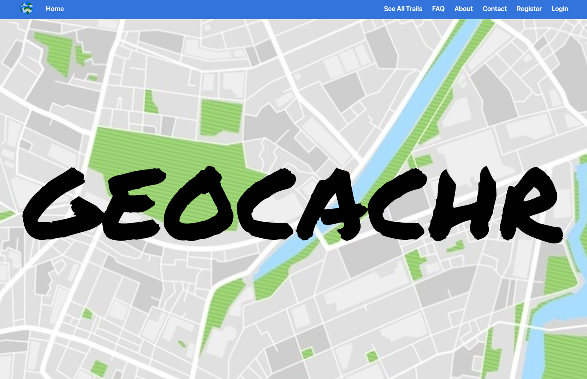
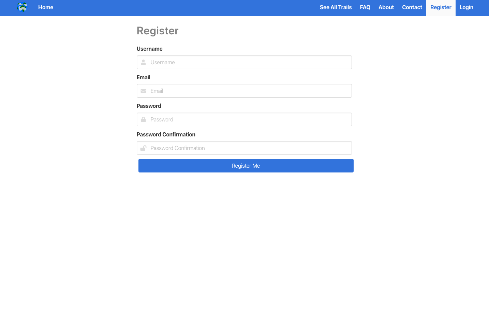
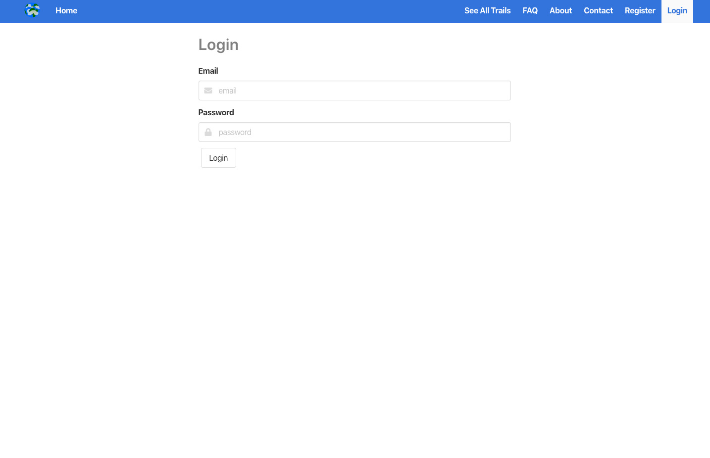
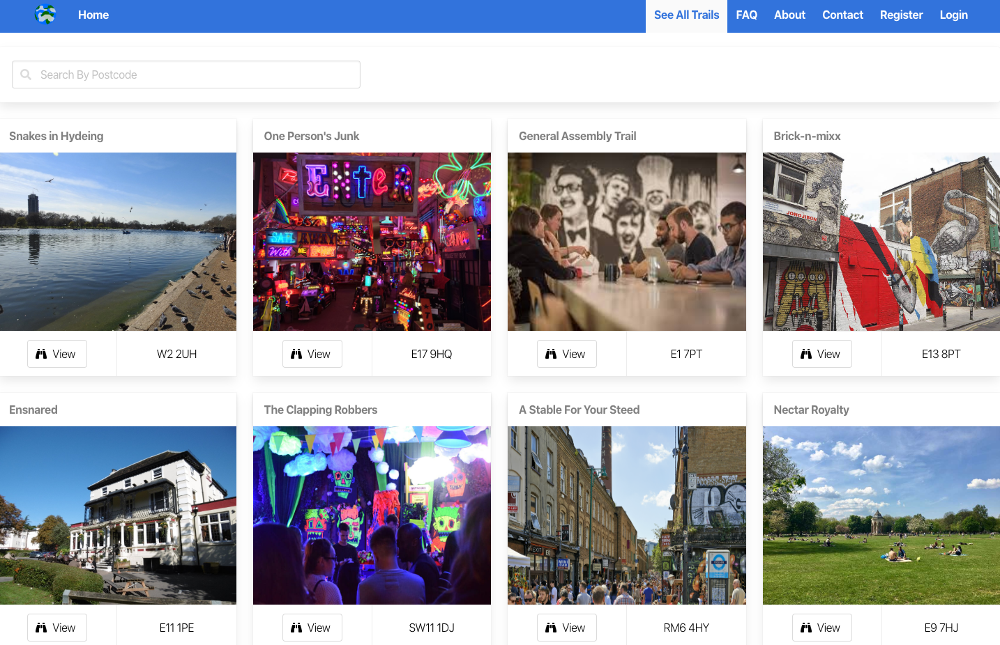
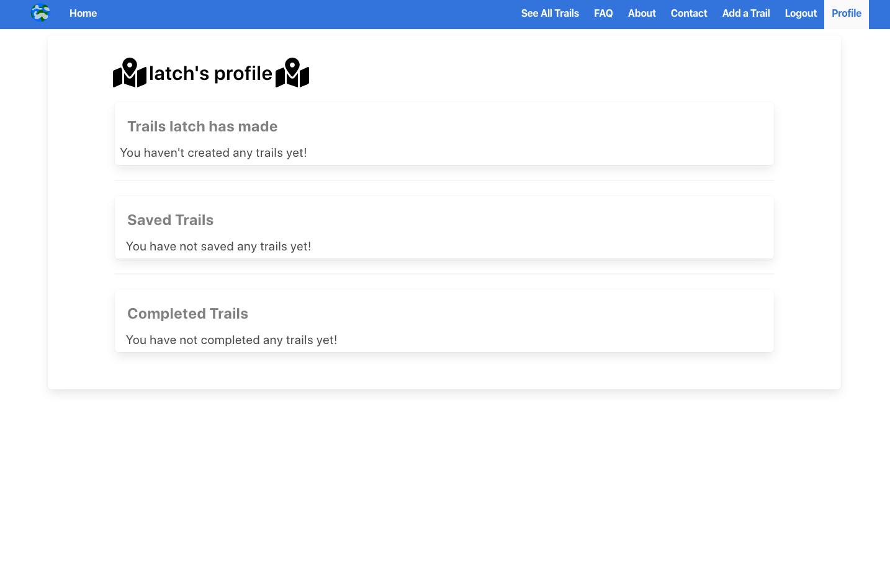
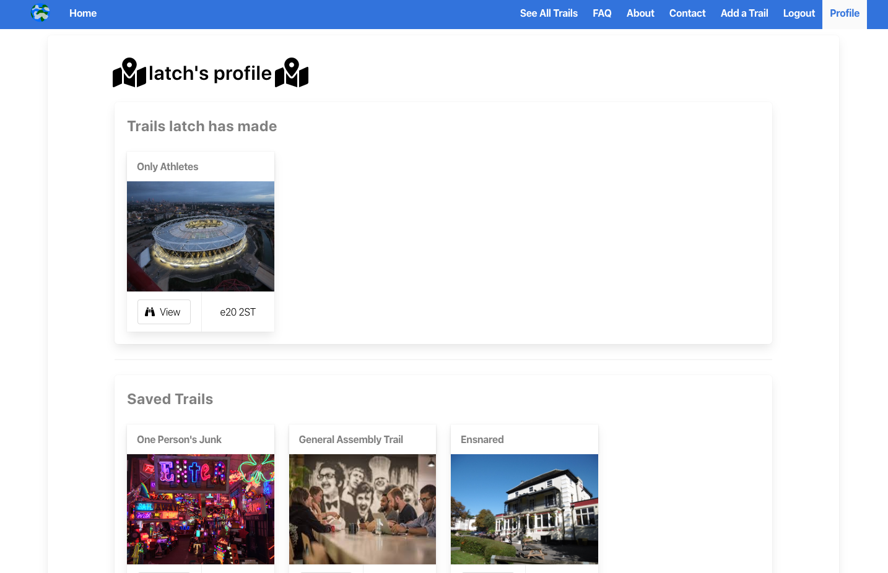
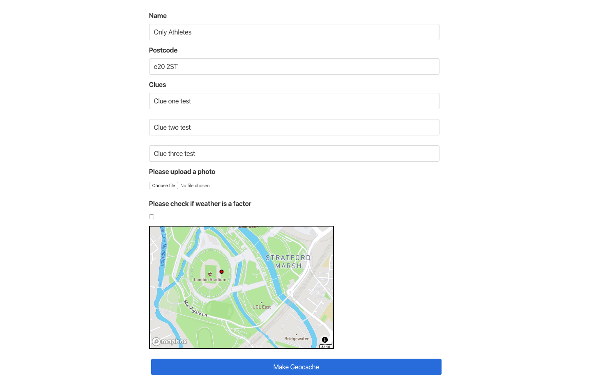
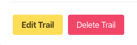
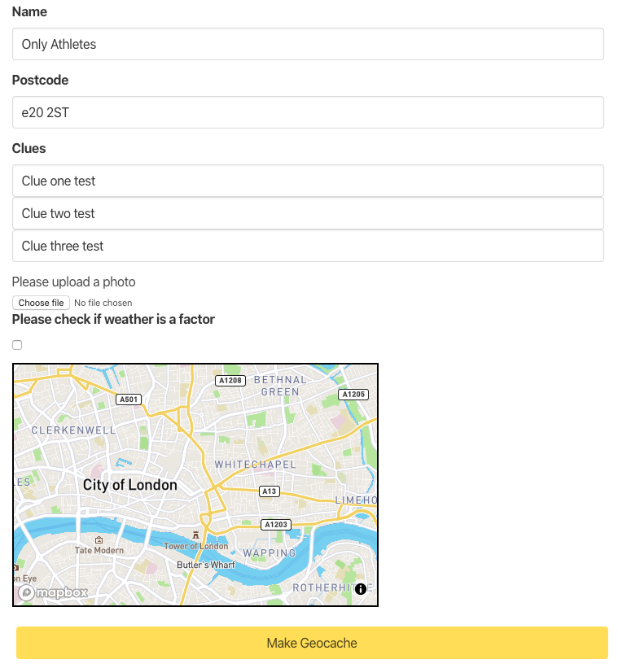
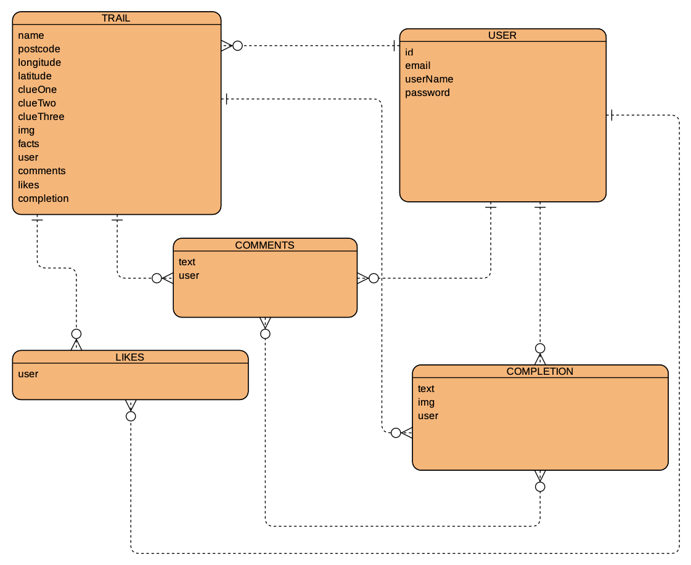

# Software Engineering Immersive: Project 3
This was the third project built whilst studying the Software Engineering Immersive course at General Assembly.

This application was built in 1 week.

## Team members
This application was built by me and my team
+ [Astara Cambata](https://github.com/astara303)
+ [Ellen Wadell](https://github.com/Ellenstarbuck)
+ [Rory Fletcher](https://github.com/Fletch-7)

# GeocachR

## Brief
The projects necessary requirements were..
* Work in a team, using git to code collaboratively.
* Build a full-stack application by making your own backend and your own front-end
* Use an Express API to serve your data from a Mongo database
* Consume your API with a separate front-end built with React
* Be a complete product which most likely means multiple relationships and CRUD functionality for at least a couple of models
* Implement thoughtful user stories/wireframes that are significant enough to help you know which features are core MVP and which you can cut
* Have a visually impressive design to kick your portfolio up a notch and have something to wow future clients & employers. ALLOW time for this.
* Be deployed online so it's publicly accessible.
* Have automated tests for _at least_ one RESTful resource on the back-end. Improve your employability by demonstrating a good understanding of testing principals.


## Tech Stack

+ HTML5
+ SCSS & Bulma
+ Javascript
  * ECMAScript6
  * React.js
  * Node.js
  * Express.js
  * axios
+ NoSQL
  * MongoDB
* API's
  * Uber's React Mapbox-GL API
  * OpenWeather API
+ Testing
  * Manual: Insomnia
  * Automated: Mocha & Chai
+ Git & GitHub
+ Additional Packages:
  * Mongoose
  * Bcrypt
  * JsonWebToken
  * body-parser
  * React Select
  * Font Awesome
  * Affinity Designer

## Release History
1.0 - This project will not be updated so as to serve as a benchmark for how much I have improved since the date (14/02/20) this was submitted and deployed.

## Deployment
This web app is deployed on Heroku and it can be found here - [GeocachR](https://getgeocachr.herokuapp.com/)

## Getting Started
Use the clone button to download the source code. In the terminal enter the following commands...
```
<!-- To install all the packages listed in the package.json: -->
$ yarn

<!-- Run the app in your localhost: -->
$ yarn start

<!-- Check the console for any issues and if there are check the package.json for any dependancies missing  -->
```

## User Experience

### Homepage
When the user arrives at the website the first thing will see is our homepage with the company logo.
We have the navbar at the top of the screen with clickable links for the user to explore the site and its functions.


### Login & Register
When a user visits our page they are able to browse through our index of trails and even look at what the clues there are to solve each trail. However they are unable to save or complete the trails and lose on out on the site's functionality without becoming a user.

User's are able to register to the site via the registration page. The register functional also validates the user's credentials to make sure they are inputting the correct type of information for their sign up process. The email box checks to see if an email address has been entered into the box and the password and password confirmation will only work if the password is type identically both times. If the password is incorrect the user will be prompted to enter it again.



Once registered a user can log in to the site which will allow them to create, edit and delete a trail. They can also save any trails that they would like to take part in, these will then be displayed on the user's profile page.


### Index
The index page with a list of all the trails available to the users. Each of the trail's cards also have a little information for the user such as the postcode that the trail is located at so the user can find one close by to them.


### Profile
Once a user has signed up and logged in, a `Profile` button is created in the navbar which is where the users can see trails they have completed, saved or created.

A picture of the user's profile when they first join GeocachR and haven't utilised its features.


A picture of the user's profile once they have saved some trail and created one of their own.


### Creating/Editing/Deleting a trail
A user is able to create and edit trails of their own once they've signed up. However they are unable to edit or delete trails that are not created by them as we have built in authentication to ensure they couldn't delete another user's trails.

To create a trail a user needs to enter the following information
1. Name of the Trail
2. Postcode the trail is located at
3. Some clues...
    * Clue One
    * Clue Two
    * Clue Three
4. A picture of the location/start point
5. A marker on the map of the location.



If the user clicks on a trail they have created, the Edit and Delete button appear.


If they click on the Edit button they are brought over to Trail Edit page and they are able to change any of the inputted data.


## Planning
When we started the project we decided very quickly that we were going to work on a project that would be about getting people outdoors and connecting them. We thought using coordinates or geolocation would be pretty interesting. We discussed spies using Deaddrops and geo-caching. 

Shortly after this we decided we would build a geo-caching website that had elements of treasure hunting (à la Nicholas Cage in National Treasure). We knew we would have to use a mapping API so that user's could use a map to display where they would like partakers to start the treasure-hunt from.

### Backend
We first got to work on building the backend of the project, for which we used MongoDB. This was essential as we needed to store a lot of information about all of the trails and our users.

This diagram displays the relationships between the models within our database.
