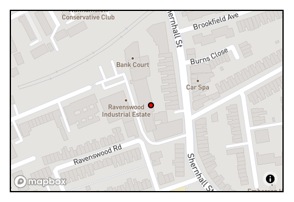

# Software Engineering Immersive: Project 3
This was the third project built whilst studying the Software Engineering Immersive course at General Assembly.

This application was built in 1 week.

## Team members
This application was built by me and my team
+ [Astara Cambata](https://github.com/astara303)
+ [Ellen Wadell](https://github.com/Ellenstarbuck)
+ [Rory Fletcher](https://github.com/Fletch-7)

# GeocachR

## Brief
The projects necessary requirements were..
* Work in a team, using git to code collaboratively.
* Build a full-stack application by making your own backend and your own front-end
* Use an Express API to serve your data from a Mongo database
* Consume your API with a separate front-end built with React
* Be a complete product which most likely means multiple relationships and CRUD functionality for at least a couple of models
* Implement thoughtful user stories/wireframes that are significant enough to help you know which features are core MVP and which you can cut
* Have a visually impressive design to kick your portfolio up a notch and have something to wow future clients & employers. ALLOW time for this.
* Be deployed online so it's publicly accessible.
* Have automated tests for _at least_ one RESTful resource on the back-end. Improve your employability by demonstrating a good understanding of testing principals.


## Tech Stack

+ HTML5
+ SCSS & Bulma
+ Javascript
  * ECMAScript6
  * React.js
  * Node.js
  * Express.js
  * axios
+ NoSQL
  * MongoDB
* API's
  * Uber's React Mapbox-GL API
  * OpenWeather API
+ Testing
  * Manual: Insomnia
  * Automated: Mocha & Chai
+ Git & GitHub
+ Additional Packages:
  * Mongoose
  * Bcrypt
  * JsonWebToken
  * body-parser
  * React Select
  * Font Awesome
  * Affinity Designer

## Release History
1.0 - This project will not be updated so as to serve as a benchmark for how much I have improved since the date (14/02/20) this was submitted and deployed.

## Deployment
This web app is deployed on Heroku and it can be found here - [GeocachR](https://getgeocachr.herokuapp.com/)

## Getting Started
Use the clone button to download the source code. In the terminal enter the following commands...
```
<!-- To install all the packages listed in the package.json: -->
$ yarn

<!-- Run the app in your localhost: -->
$ yarn start

<!-- Check the console for any issues and if there are check the package.json for any dependancies missing  -->
```

## User Experience

### Homepage
When the user arrives at the website the first thing will see is our homepage with the company logo.
We have the navbar at the top of the screen with clickable links for the user to explore the site and its functions.


### Login & Register
When a user visits our page they are able to browse through our index of trails and even look at what the clues there are to solve each trail. However they are unable to save or complete the trails and lose on out on the site's functionality without becoming a user.

User's are able to register to the site via the registration page. The register functional also validates the user's credentials to make sure they are inputting the correct type of information for their sign up process. The email box checks to see if an email address has been entered into the box and the password and password confirmation will only work if the password is type identically both times. If the password is incorrect the user will be prompted to enter it again.


Once registered a user can log in to the site which will allow them to create, edit and delete a trail. They can also save any trails that they would like to take part in, these will then be displayed on the user's profile page.


### Index
The index page with a list of all the trails available to the users. Each of the trail's cards also have a little information for the user such as the postcode that the trail is located at so the user can find one close by to them.


### Profile
Once a user has signed up and logged in, a `Profile` button is created in the navbar which is where the users can see trails they have completed, saved or created.

A picture of the user's profile when they first join GeocachR and haven't utilised its features.


A picture of the user's profile once they have saved some trail and created one of their own.


### Creating/Editing/Deleting a trail
A user is able to create and edit trails of their own once they've signed up. However they are unable to edit or delete trails that are not created by them as we have built in authentication to ensure they couldn't delete another user's trails.

To create a trail a user needs to enter the following information
1. Name of the Trail
2. Postcode the trail is located at
3. Some clues...
    * Clue One
    * Clue Two
    * Clue Three
4. A picture of the location/start point
5. A marker on the map of the location.


If the user clicks on a trail they have created, the Edit and Delete button appear.


If they click on the Edit button they are brought over to Trail Edit page and they are able to change any of the inputted data.


## Planning
When we started the project we decided very quickly that we were going to work on a project that would be about getting people outdoors and connecting them. We thought using coordinates or geolocation would be pretty interesting. We discussed spies using Deaddrops and geo-caching. 

Shortly after this we decided we would build a geo-caching website that had elements of treasure hunting (à la Nicholas Cage in National Treasure). We knew we would have to use a mapping API so that user's could use a map to display where they would like partakers to start the treasure-hunt from.

### Backend
We first got to work on building the backend of the project, for which we used MongoDB. This was essential as we needed to store a lot of information about all of the trails and our users.
We designed our models so we knew how our models would connect and then started building.

This diagram displays the relationships between the models within our database.


This diagram's purpose was to outline which pieces of data were stored in which model. The lines from the models that have a single horizontal (or vertical in some cases) are displaying that the model with being given only one segment of data from the model it is connected to. The lines with the fork endings are indicating that these models are receiving multiple segments of data from the other connecting model.

In the case of our application a registered user can leave comments and likes on each trail (a one-to-many relationship). Whereas a trail, comment and a like can only belong to/be created by one user (a many-to-one relationship).

### Frontend
The frontend of our application was built using React.js. We pulled in the data from our APIs and backend using axios. The frontend was built in many small React components that we built separately and then pieced together.

Our components were separated into three separate categories. We had an authentication folder which containted the registration and the login components. We had another folder for all of the trail components, for components such as the forms for creating a trail or the trail completion form. It is also where we store the trail card and trail show component.
The last folder was for the common components. This was where we stored components such as our navbar, footer and the map components.

### My contributions
The main focus for me in the projest was building the map component. It was integral to the project so I took some time to plan how I could build a very functional and reusable component.

First I spent time researching which API would be best for the map component.
I narrowed it down to a few different options...
1. GoogleMaps - I decided against Googlemaps after discovering What3Words.
2. What3Words - This was the API that I initially wanted to use as it is extremely precise. I thought would be great as we could use the exact position of each square as the API returns three words for a 3m x 3m square. However the documentation warned against using the API to try and convert postcodes (which is initially what we thought we would build into the app).
3. Mapbox - I'd used this API before but decided against it as it's documentation is purely for Vanilla JavaScript and felt that I should look for a React alternative.

After I decided I wouldn't use What3Words I came across Uber's repository for Mapbox. They updated and built a library ontop of the API. This API was built for use with React which was perfect for our project. 

I built two separate, reusable map components. The reason for this is I wanted to have a smart and a dumb component. One would be able to only accept props and the other was a fully functioning component where the user could scroll, zoom and place a marker which would save the coordinates into the trail's database entry.




_My smart map component_
```js
class Map extends React.Component {

  state = {
    viewport: {
      width: 450,
      height: 300,
      latitude: 51.515313,
      longitude: -0.071626,
      zoom: 12
    },
    clickedLocation: null,
    showPopup: false
  }

  render() {
    console.log(this.props)
    return (
      <div className="columns">
        <div className="column  ">
          <ReactMapGL mapboxApiAccessToken={mapboxToken}
            mapStyle="mapbox://styles/mapbox/streets-v9" 
            {...this.state.viewport} 
            onViewportChange={viewport => this.setState({ viewport })}
            onClick={this.props.handleMap}
          >
            {this.props.data.latitude &&
              <Marker 
                longitude={this.props.data.longitude} 
                latitude={this.props.data.latitude} > 
                <div className="pin" /> 
              </Marker>
            }
          </ReactMapGL>
        </div>
      </div>
    )
  }
}

export default Map
```
In this component I set the state of the map so that it always first appears zoomed out at the specific latitude and longitude. This component is used on the `Create a Trail` page so that registered users can place the marker of where they would like the treasure hunt to begin. This will be saved when the submit their trail, and will remain there if they click the edit button with the ability to be moved.

The map is moved by the functions handleMap and onViewportChange which re-render the map as the mouse is clicked and dragged on it.

_My dumb map component_
```js
const IdMap = ({ data: { latitude, longitude } }) => {

  const viewport = {
    width: 450,
    height: 300,
    zoom: 16
  }

  return (
    <div className="columns">
      <div className="column  ">
        <ReactMapGL 
          mapboxApiAccessToken={mapboxToken}
          mapStyle="mapbox://styles/mapbox/streets-v9" 
          {...{ ...viewport, latitude, longitude } } 
        >
          {latitude &&
          <Marker 
            longitude={longitude} 
            latitude={latitude} > 
            <div className="pin" /> 
          </Marker>
          }
        </ReactMapGL>
      </div>
    </div>
  )
}

export default IdMap
```
This component is not responsive when the user clicks on it, it is purely just for display purposes. It can't be moved as it doesn't have the two functions that enable that feature. I disabled that feature here as I wanted the user to only be able to see what was necessary (the starting point).

This map component is used on the trail show page where it displays the marker of the coordinates store in the trails data.

After building the map components I built the About page and also went on to write a test for the `delete a trail` function.

## Challenges and Improvements

### Challenges
The main challenges I had on this project were...
1. Creating the dumb map component. It took me quite a few attempts to get it working right.
2. Getting the map to be responsive for use on mobile and tablets.

### Improvements
The improvements I would like to make to the project would be...
1. Figure out how to make the map responsive with the shrinking and growing of the browser window.
2. A nice to have that we didn't have enough time to implement would have been if we could allow users to look at another user's profile, add friends and see their activity.

### Wins
I learnt a lot in the process of building this application. I learnt a lot about the relationships between models in the database. This project also gave me a lot of practice with reading and understanding the documentation. I learnt the importance of good documentation as without it, this project would have been much more challenging.
___

#### Author
Latch Jack - You can contact me via [Twitter](https://twitter.com/LatchCodes "My twitter profile") or via [email](mailto:latch.jack@gmail.com "my email").

Thank you for visiting my repository! :)